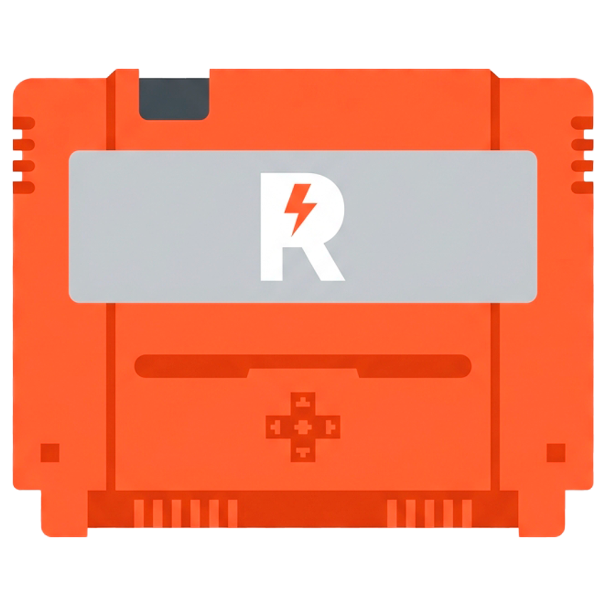
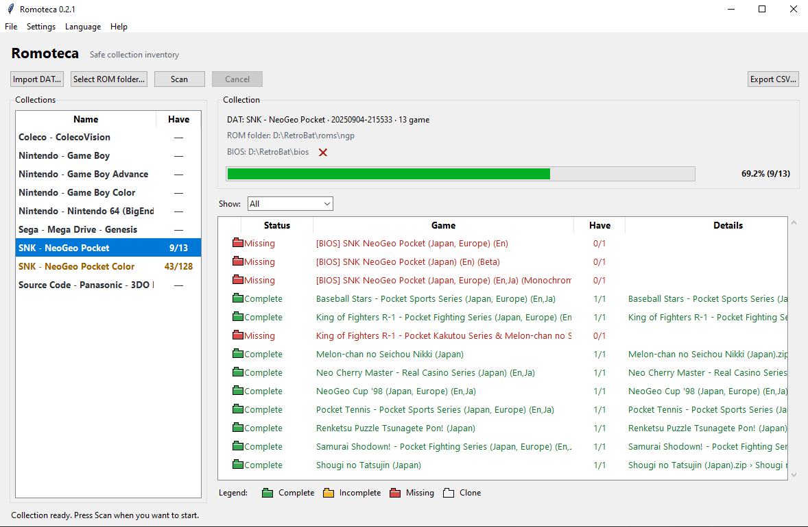

# Romoteca

Romoteca is a safe and straightforward desktop inventory for ROM collections.
Load DAT catalogs, select your own folders and see which games are complete,
incomplete or missing without altering the collection.





## Features

- Read-only scanning: ROM files are never moved, renamed or deleted.
- Logiqx/ClrMamePro-style XML DAT catalogs.
- Multiple collections with a compact overview.
- Loose files and ZIP contents matched by SHA-1 or CRC32 and size.
- Automatic RetroBat/Batocera BIOS-folder detection with a manual override.
- English, Spanish, French, German, Dutch and Russian interface.
- CHD, RAR and 7Z inventory without modifying the original collection.
- CHD content verification through the external MAME `chdman` tool.
- CSV report export.
- Local DAT library. Third-party DAT files are not bundled.
- Optional online DAT discovery from official Redump HTTPS downloads.
- Community DAT Catalog support through HTTPS RAW files hosted on GitHub.
- Configurable scan workers, light/dark theme and multilingual interface.
- Direct links to the official DAT database websites.
- Modified/translated file classification for common patch and translation markers.
- Persistent CHD result cache that stores only metadata and hashes.
- Light and dark themes, including the native Windows title bar.

Romoteca is open-source software released under the MIT License.

## CHD support

CHD verification is optional and requires the external `chdman` executable from the [MAME project](https://www.mamedev.org/). Romoteca does not bundle `chdman`; select its location from **Settings → CHD tool…**. The tool is used read-only: Romoteca extracts each CHD to a temporary directory, hashes the virtual CUE/BIN tracks against the selected DAT, and removes the extracted files and directory when the scan finishes.

The first scan of a large CHD collection can take a while because the images have to be read and temporarily expanded. The time depends heavily on the storage device and the number and size of the images. Development and testing were performed on an 8 TB Seagate BarraCuda 5,400 RPM hard drive. Subsequent scans reuse a small metadata/hash cache stored in `%LOCALAPPDATA%\\Romoteca\\chd-cache.json`; extracted images are never kept in that cache. If a CHD is changed, moved or scanned with a different `chdman` executable, it is verified again.

CHD verification does not change, rename or delete any ROM. A CHD that is healthy but does not match the selected DAT is reported separately from a confirmed match. Translated or patched files are classified as **Modified / translated** when their names contain common translation or patch markers; the filename heuristic is not a substitute for a DAT hash match.

## Release 0.4.3

- Added CHD extraction and DAT matching through an externally selected `chdman` executable.
- Added persistent CHD metadata/hash caching for fast repeat scans.
- Improved cleanup of temporary CHD extraction folders.
- Added the Modified / translated result category and filter.
- Added native Windows title-bar colour refresh when switching themes.
- Expanded documentation and preservation-project acknowledgements.

## Acknowledgements

Romoteca gratefully acknowledges the preservation work of [Redump](https://redump.info/), [No-Intro](https://www.no-intro.org/) and [TOSEC](https://www.tosecdev.org/). Their databases and DAT files are maintained by their respective communities and are not bundled with Romoteca. Please consult each project's own terms when downloading or using their data.

## Run from source

Python 3.11 or later is required.

```powershell
py main.py
```

## Build the Windows executable

```powershell
powershell -ExecutionPolicy Bypass -File .\build_exe.ps1
```

The executable is created at `dist\Romoteca.exe`.

## Linux

Build a portable Linux binary with:

```bash
bash build_linux.sh
```

The resulting `dist/Romoteca-linux-x86_64.tar.gz` contains the executable. GitHub Actions also builds this asset automatically for tagged releases.
